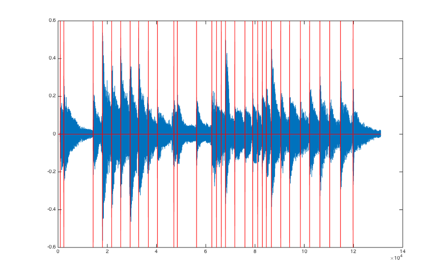

# 音乐合成综合实验

## 1. 简单的合成音乐

### 1.1 用乐音信号拼出《东方红》第一小节

本题较为简单，可以直接将几个正弦信号拼接在一起实现。

然而，这种实现方法中各个乐音是完全独立的，无法适应 1.2 中用包络修正的需求（即交叠部分无法实现）。

所以，我们采用如下的结构。`*_tone` 函数在某一时刻产生一特定频率的乐音，`make_music` 函数使用传入的乐音生成函数生成《东方红》，`play_music` 函数调用 `make_music` 生成并播放音乐。各个函数代码如下：

```matlab
%% trivial_tone: Generate a tone of a certain frequency
function signal = trivial_tone(t, t_start, duration, f)
    interval = (t >= t_start & t < t_start + duration);

    signal = zeros(size(t));
    signal(interval) = sin(2 * pi * f * t(interval));
```

```matlab
%% make_music: Use certain tone generator to make music.
function [t, music] = make_music(generator, f_sample)
    beat = 0.5;
    t_total = 5;
    f = [349.23, 392, 440, 466.16, 523.25, 587.33, 659.25, 698.46];

    t = linspace(0, t_total - t_total / f_sample, t_total * f_sample);

    tones = [f(5), f(5), f(6), f(2), f(1), f(1), f(6) / 2, f(2)];
    beats = [1, 0.5, 0.5, 2, 1, 0.5, 0.5, 2];

    t_now = 0;
    music = zeros(size(t));
    for tone_num = 1:length(tones)
        duration = beats(tone_num) * beat;
        % Add this tone to the music using generator.
        music = music + generator(t, t_now, duration, tones(tone_num));
        t_now = t_now + duration;
    end

    music = music / max(music);  % Make sure signal <= 1.
```

```matlab
%% play_music: Play music using a certain generator.
function play_music(generator)
    f_sample = 8e3;
    [t, music] = make_music(generator, f_sample);
    sound(music, f_sample);
```

然后使用 `play_music(@trivial_tone)` 来播放音乐，确实可以听到”啪“的杂声。


### 1.2 用包络修正乐音

在这里，我们使用教材中 `图 6.5` 所示的包络描述音量的变化，如下图所示：


其中参数包括：
* 各段所占时间比例
* 峰值音量
* 持续音量
* 指数衰减系数

代码如下：

```matlab
%% tone_shape: Volumn at a certain time point.
function amp = tone_shape(t, duration)
    % Parameters.
    impulse_ratio = 0.15;
    decay_ratio = 0.15;
    stay_ratio = 0.5;
    peak_amp = 1;
    stay_amp = 0.8;
    fade_coefficient = 7;

    impulse_end = impulse_ratio * duration;
    decay_end = impulse_end + decay_ratio * duration;
    stay_end = decay_end + stay_ratio * duration;

    % Stages.
    impulse = (t >= 0 & t < impulse_end);
    decay = (t >= impulse_end & t < decay_end);
    stay = (t >= decay_end & t < stay_end);
    fade = (t >= stay_end);

    amp = zeros(size(t));
    amp(t < 0) = 0;
    amp(impulse) = linspace(0, peak_amp, sum(impulse));
    amp(decay) = linspace(peak_amp, stay_amp, sum(decay));
    amp(stay) = stay_amp;
    amp(fade) = stay_amp * exp(fade_coefficient * ...
                               (stay_end - t(fade)) / duration);
```

乐音生成函数：

```matlab
%% refined_tone: Generate a tone of a certain frequency with refined shape
function signal = refined_tone(t, t_start, duration, f)
    interval = (t >= t_start);

    signal = zeros(size(t));
    signal = tone_shape(t - t_start, duration) .* sin(2 * pi * f * t);
```

修正后音乐的波形：


### 1.3 升高 & 降低音阶

对于简单的音调变换，可以直接更改输入给 `sound` 的 `FS` 参数，即改变播放时的采样频率。

```matlab
%% trivial_change_octave.m
f_sample = 8e3;
[t, music] = make_music(@refined_tone, f_sample);
sound(music, 2 * f_sample);  % One octave higher.
pause(2.5);
sound(music, 0.5 * f_sample);  % One octave lower.
```

要升高半个音阶，则应该先使用 `rat` 函数找到半个音阶（2^(1/12)）的有理近似，再使用 `resample` 函数进行重采样。代码如下：

```matlab
%% resample_higher_octave.m
f_sample = 8e3;
[Q, P] = rat(2^(1/12), 0.0000001);  % Find the rational approximation.
[t, music] = make_music(@refined_tone, f_sample);
sound(resample(music, P, Q), f_sample);
```

其中 [Q, P] 在实验中得到的实际值是 [3118, 2943]。

需要注意的是，得到的三段音乐都有变速。

### 1.4 增加谐波分量

使用教材中的谐波分量幅度，代码如下

```matlab
%% harmonic_tone: generate a harmonic refined tone of a certain frequency
function signal = harmonic_tone(t, t_start, duration, f)
    interval = (t >= t_start);

    shape = [1, 0.2, 0.3] * sin(2 * pi * f * [1:3]' * t);
    signal = tone_shape(t - t_start, duration) .* shape;
```

其中计算合成信号时使用的是矩阵运算。

合成出的音乐确实要有“厚度”一些，听起来也确实有些像风琴。

### 1.5 自选其他音乐合成

（暂略）

## 2. 用傅里叶级数分析音乐

### 2.1 播放 `fmt.wav`

听起来确实要比刚刚的合成音乐真实不少 = =…

需要注意的是，在 Matlab R2014b 上调用 `wavread` 时得到了一个警告：

    Warning: WAVREAD will be removed in a future release. Use AUDIOREAD
    instead.

所以改为使用 `audioread` 播放音乐：

```matlab
sound(audioread('../../resource/fmt.wav'))
```

### 2.2 预处理 `realwave` => `wave2proc`

从 `realwave` 的时域波形中可以看出，其大约经历了 10 个完整的周期。故为了去除非线性谐波和噪声，我们可以取 10 个周期的均值。

然而注意到 `realwave` 包含 243 个采样点，不是 10 的倍数，故先对其进行 10 倍频，取得周期均值之后将波形重复十次，再进行十分频。

代码如下：

```matlab
%% preprocess: Remove noises from realwave
function wave2proc = preprocess(realwave, cycle)
    cycle_wave = mean(reshape(resample(realwave, cycle, 1), ...
                              [length(realwave), cycle])')';
    wave2proc = resample(repmat(cycle_wave, [cycle, 1]), ...
                         1, cycle);
```

如图所示，处理得到的信号与 `wave2proc` 相差无几：


### 2.3 分析基频 & 谐波

为了分析这段音乐的基频，我们很容易想到使用快速傅里叶变换来计算。

```matlab
len = length(wave2proc);
f = [0:len-1] / len * 8000;
plot(f, abs(fft(wave2proc)))
xlabel 'f / Hz'
ylabel Amp
```


我们成功得到了这段音乐的频谱。然而可以发现，我们得到的频谱分辨率不是很高。由采样定理可知，时域采样频率决定了频域宽度；反过来，由对偶性可知，时域宽度决定了频域采样间隔。故我们可以通过重复时域信号的方式增加频域分辨率：

```matlab
for n = 1:4
    w = repmat(wave2proc, [2^(n-1),1]);
    len = length(w);
    f = [0:len-1] / len * 8000;
    subplot(220 + n);
    plot(f, abs(fft(w)));
    xlabel 'f / Hz'
    ylabel Amp
    title(strcat('x', num2str(2^(n-1))))
end
```


*图像的对比展示方法借鉴了韩神的设计。*

可以看到，频域的分辨率确实提高了，其包络也越来越趋近于冲激函数。

为了分析基频和谐波分量，我们进行如下操作：

1. 根据对称性取出频谱的前一半；
2. 去除幅度小于阈值的点，这里选取为 0.1 倍最大值；
3. 找到最大峰，暂设为基频；
4. 依次查看最大峰频率的 1/2, 1/3, 1/4 处附近的频谱，若有较大幅度则说明原基频为高次谐波分量，将较小的频率作为新的基频；
5. 在基频的 2, 3, 4 倍频率附近寻找高次谐波分量。

代码如下：

```matlab
%% analyze_freq: Analyze the freq of a signal.
function [baseband, band_wights, tone] = analyze_freq(sig, f_sample)
    error_ratio = 0.01;

    f = abs(fft(sig));
    f = f(1:ceil(length(f) / 2));  % Only use the lower half.
    f(f < 0.1 * max(f)) = 0;  % Truncate insignificant bands.

    %% Only care about the most significant band.
    [max_wight, max_band] = max(f);

    %% Find base band.
    baseband = max_band;
    base_wight = max_wight;
    for ratio = [2, 3, 4]
        band = (max_band - 1) / ratio + 1;
        [maximum, index] = max_around(f, band, error_ratio);
        if maximum > 0.4 * max_wight
            baseband = index;
            base_wight = maximum;
        end
    end

    %% Calculate wights.
    band_wights = [base_wight];
    for ratio = [2, 3, 4]
        band_wights(ratio) = max_around(f, ratio * baseband, error_ratio);
    end
    band_wights = band_wights / base_wight;

    %% Calculate baseband.
    baseband = (baseband - 1) / length(sig) * f_sample;

    %% Match tone.
    tone = match_tone(baseband);
end

%% max_around: Find maximum around a index.
function [maximum, index] = max_around(x, index, error_ratio)
    from = ceil(index *  (1 - error_ratio));
    to   = floor(index * (1 + error_ratio));
    [maximum, index] = max(x(from:to));
    index = index + from - 1;
end
```

`match_tone` 函数负责找到某一频率最接近的音调：

```matlab
%% match_tone: Find the closest tone to a certain frequency.
function tone = match_tone(f)
    load tones
    [value, index] = min(abs(tone_freqs - f));
    tone = tone_names{index};
```

其中 `tones.mat` 中包含了一下两个变量：

* `tone_names`: 各音调的名字
* `tone_freqs`: 各音调的频率

调用函数：

```matlab
[baseband, band_wights, tone] = analyze_freq(repmat(wave2proc, [64, 1]), 8000)

% baseband =
%
%   329.2181
%
%
% band_wights =
%
%     1.0000    1.4572    0.9587    1.0999
%
% tone =
%
% e1
```

故这段信号的基频是 329.22 Hz, 是 e1 音。

### 2.4 自动分析乐曲的音调和节拍

为了自动标记出每个音调的起始时间，我们先来分析时域波形幅度的特点。

在起始点前 700 ~ 200ms 处，之前音调的音量已经基本消失，并基本保持不变。我们把这一段称为 **谷段**，如图所示：


在起始点前 200ms 到起始点处，新的音调音量迅速爬升，然后取得一个 **峰值**。我们把这一段称为 **坡段**，如图所示：


于是我们想到，可以通过 `峰值 / 谷段均值` 来识别出起始点。其中，去除坡段是为了使匹配处的比值更大，去除坡段对匹配精度的影响。

首先，我们需要计算谷段的平均值：

```matlab
%% moving_avg: Shifted moving average.
function avg = moving_avg(x, lag_from, lag_to)
    lag = lag_from - lag_to + 1;
    shifted = [zeros(lag_to, 1); x(1:length(x)-lag_to)];
    avg = movavg(shifted, lag, lag, 0);
```

然后计算峰值与其的比值，并截去过大的值

```matlab
abs_wave = abs(wave);
avg = abs_wave ./ moving_avg(abs_wave, 700, 200);
avg(avg > 10) = 10;
avg(isnan(avg)) = 0;  % Caused by 0/0
```

结果如下图所示。其中中图为未去除 0 ~ 200ms 坡段的结果，下图为去除后的结果。可以看到，去除坡段确实提升了匹配精度。


然后根据图像，我们设置一个阈值，同时去除以下点：
* 比值过小的点（这里选取阈值为 3.5）
* 峰值过小的点（这里选取阈值为 0.1）
* 坡段上升速度过小的点（这里选取 50 ~ 0ms 与 100 ~ 50ms 的比值，阈值取 1.3）

```matlab
rising0 = moving_avg(abs_wave, 100, 50);
rising1 = moving_avg(abs_wave, 50, 0);
avg(avg < 3.5 | abs_wave < 0.1 | 1.3 * rising0 > rising1) = 0;
```

得到结果如下：


合并相邻点并归一化，并与原波形一同显示：

```matlab
[value, index] = sort(avg, 'descend');
t = 1:length(avg);
for k = t
    if avg(index(k)) > 0
        avg(t > index(k) - 500 & t < index(k) + 500 & t ~= index(k)) = 0;
    end
end
avg(avg > 0) = 1;
```



可以看到，音调起始点都被很好地识别了出来。

然后，我们便可以用 2.3 中的 `analyze_freq` 函数完成音调的分析：

```matlab
endpoints = [beats, length(wave)];
for k = 1:length(beats)
    w = wave(endpoints(k):endpoints(k+1));
    from(k, 1) = (endpoints(k) - 1) / 8000;
    to(k, 1) = (endpoints(k + 1) - 1) / 8000;
    [baseband(k, 1), band_wights(k, 1:4), this_tone] = analyze_freq(w, 8000);
    tone{k, 1} = this_tone;
end

report = table([from, to, to - from], round((to - from) / 0.239) * 0.5, ...
                baseband, band_wights(:, 2:4), tone, ...
               'VariableNames', ...
               {'From_To_Last' 'Beats' 'Baseband' 'HarmonicComponents' 'Tone'})

% report = 
%
%             From_To_Last             Beats    Baseband         HarmonicComponents          Tone
%     _____________________________    _____    ________    _____________________________    ____
%
%     0.11325    0.29437    0.18112    0.5      220.69            0          0          0    'a' 
%     0.29437     1.7811     1.4868      3      221.94      0.27324    0.12986          0    'a' 
%      1.7811      2.255    0.47387      1      246.84      0.49568    0.14423     0.1783    'b' 
%       2.255     2.7211    0.46612      1      220.91       0.1953    0.17019          0    'a' 
%      2.7211     3.1795    0.45838      1      294.44       1.0972    0.22561          0    'd1'
%      3.1795     3.6589    0.47938      1      329.51      0.90262    0.81718     1.1179    'e1'
%      3.6589      4.093    0.43412      1      195.74      0.66676    0.47636    0.10421    'g' 
%       4.093     4.5854    0.49238      1      174.62      0.28199          0          0    'f' 
%      4.5854      5.049    0.46363      1      174.66       0.3431          0          0    'f' 
%       5.049     5.8801    0.83112    1.5      294.74      0.89099    0.17222          0    'd1'
%      5.8801     6.0563    0.17613    0.5      209.93            0          0          0    'ba'
%      6.0563     7.0323      0.976      2      247.92      0.35703    0.16699    0.46617    'b' 
%      7.0323     7.8076    0.77537    1.5      163.77       1.8645    0.32555     2.2284    'e' 
%      7.8076     8.0461     0.2385    0.5      222.11      0.10631          0          0    'a' 
%      8.0461     8.2854    0.23925    0.5      221.41        0.404    0.10437          0    'a' 
%      8.2854     8.5005    0.21513    0.5         223            0    0.15191          0    'a' 
%      8.5005     8.9736    0.47312      1      219.76            0      1.608          0    'a' 
%      8.9736     9.4883    0.51463      1      440.99      0.35356    0.40862          0    'a1'
%      9.4883      9.882    0.39375      1      220.88      0.32475    0.16159          0    'a' 
%       9.882     10.136    0.25362    0.5      394.09      0.44829    0.10279          0    'g1'
%      10.136     10.373    0.23738    0.5      349.47      0.31756    0.18042    0.16302    'f1'
%      10.373     10.576    0.20325    0.5      329.44       1.7798     1.0048    0.20917    'e1'
%      10.576     10.833    0.25638    0.5       292.4       1.1386    0.26579          0    'd1'
%      10.833     11.308     0.4755      1      330.09       2.3497    0.91727     1.1553    'e1'
%      11.308     11.754    0.44587      1      246.64      0.58399    0.29418    0.41069    'b' 
%      11.754     12.304    0.55013      1      147.21       2.1545    0.40273     0.3346    'd' 
%      12.304     12.772    0.46775      1      260.75      0.54611    0.20659          0    'c1'
%      12.772     13.294    0.52225      1       174.2      0.26665          0    0.12125    'f' 
%      13.294     13.793     0.4985      1      222.61            0    0.11048          0    'a' 
%      13.793     14.338    0.54575      1      247.31      0.70196    0.20336    0.23897    'b' 
%      14.338     14.979      0.641    1.5      221.49      0.22656    0.11021          0    'a' 
%      14.979     16.384     1.4045      3      210.02      0.14811    0.35534          0    'ba'
```

*表格的结构借鉴了韩神的设计。*

我们便得到了这段音乐中每个音调的信息。

## 3. 基于傅里叶级数的合成音乐

### 3.1 使用 2.3 的傅里叶级数完成 1.4

### 3.2 演奏一首东方红

### 3.3 用图形界面封装程序
